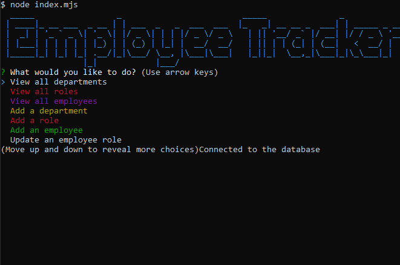
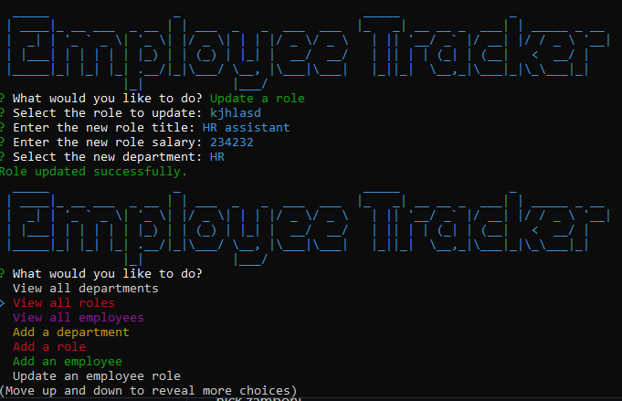

# Employee Data Tracker App!

https://github.com/ndzamboni/employeeTracker

    

## 📖 Description

This app takes the user input to store, update, add, remove employee data in detail. This app stores data to a Postgre SQL database and allows the user to easily manipulate the data via this app. 

## 📑 Table of Contents

1. [Description](#description)
2. [Installation](#installation)
3. [Usage](#usage)
4. [Demo](#demo)
5. [Contributions](#contributions)
6. [Author](#author)
7. [License](#license)
    

## 🛠 Installation

git pull the repository, then npm install to receive all the packages. 

## 🚀 Usage

node index.mjs

## 🎥 Demo

<!-- how to insert screenshots -->

## 🤝 Contributions

nick zamboni

## 🧑‍💻 Author

ndzamboni

## 📜 License

MIT

    
